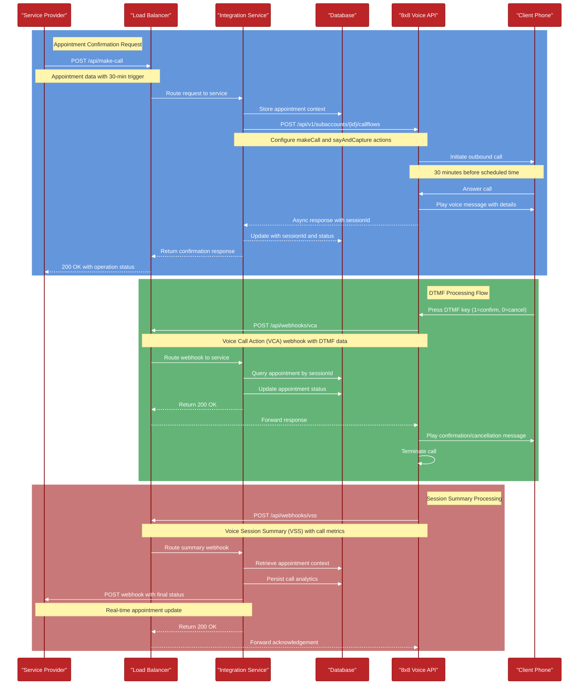

## Flow Description

1. **Appointment Confirmation Request**
 - Service Provider sends call request with appointment details
 - Request routes through Load Balancer to Integration Service
 - Service stores appointment context in Database
 - Service configures call flow with 8x8 Voice API
 - 8x8 initiates outbound call 30 minutes before scheduled time
 - Client receives call with appointment details
 - Confirmation responses flow back through the system

2. **DTMF Processing Flow**
 - Client presses 1 (confirm) or 0 (cancel) on their phone
 - 8x8 Voice API sends VCA webhook with DTMF input
 - Request routes to Integration Service
 - Service updates appointment status in Database
 - Response flows back to 8x8 Voice API
 - Client hears confirmation/cancellation message
 - Call terminates

3. **Session Summary Processing**
 - Call ends with client
 - 8x8 Voice API sends Voice Session Summary with call metrics
 - Summary routes to Integration Service
 - Service retrieves context and persists call analytics
 - Service sends real-time update to Service Provider
 - System acknowledges receipt of summary
