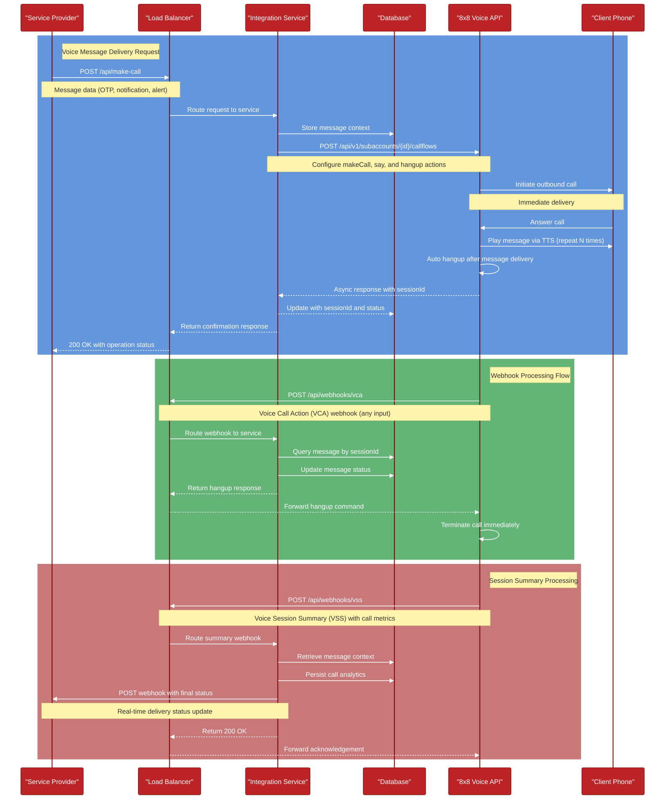

## Flow Description

1. **Voice Message Delivery Request**
 - Service Provider sends call request with message content (OTP, notification, alert)
 - Request routes through Load Balancer to Integration Service
 - Service stores message context in Database
 - Service configures call flow with 8x8 Voice API (makeCall + say + hangup)
 - 8x8 initiates outbound call for immediate delivery
 - Client receives call and hears message via text-to-speech
 - Call automatically hangs up after message delivery (repeated N times)
 - Confirmation responses flow back through the system

2. **Webhook Processing Flow**
 - 8x8 Voice API sends VCA webhook for any call events or input
 - Request routes to Integration Service via Load Balancer
 - Service updates message delivery status in Database
 - Service responds with hangup command for any input
 - Response flows back to 8x8 Voice API
 - Call terminates immediately on any client input

3. **Session Summary Processing**
 - Call ends with client
 - 8x8 Voice API sends Voice Session Summary with call metrics
 - Summary routes to Integration Service
 - Service retrieves context and persists call analytics
 - Service sends real-time delivery status update to Service Provider
 - System acknowledges receipt of summary
