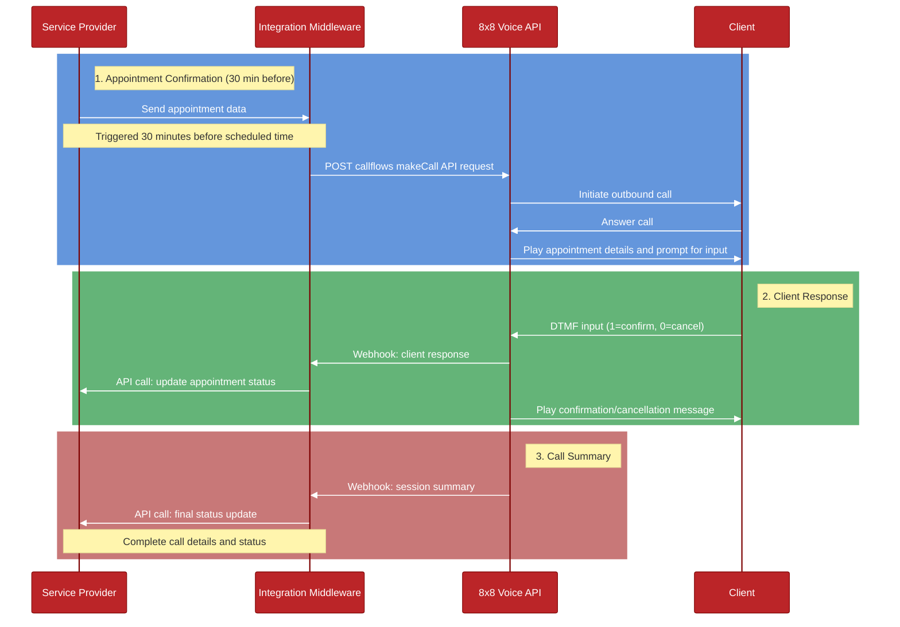

# System Interaction Flow Diagram

## Flow Description

1. **Initial Make Call Request**
  - Client application sends request to ngrok public URL
  - Ngrok forwards to local FastAPI server
  - FastAPI server calls 8x8 Voice API
  - Response flows back through the chain
  - 8x8 initiates phone call to recipient

2. **VCA (Voice Call Action) Webhook**
  - Recipient presses 1 (confirm) or 0 (cancel) on their phone
  - 8x8 Voice API sends DTMF input to ngrok URL
  - Request forwarded to FastAPI
  - FastAPI processes and returns next actions
  - Response flows back to 8x8 Voice API
  - Recipient hears confirmation/cancellation message

3. **VSS (Voice Session Summary) Webhook**
  - Call ends with recipient
  - 8x8 Voice API sends final call summary
  - Request forwarded through ngrok to FastAPI
  - FastAPI processes and acknowledges
  - Simple 200 OK response returned
