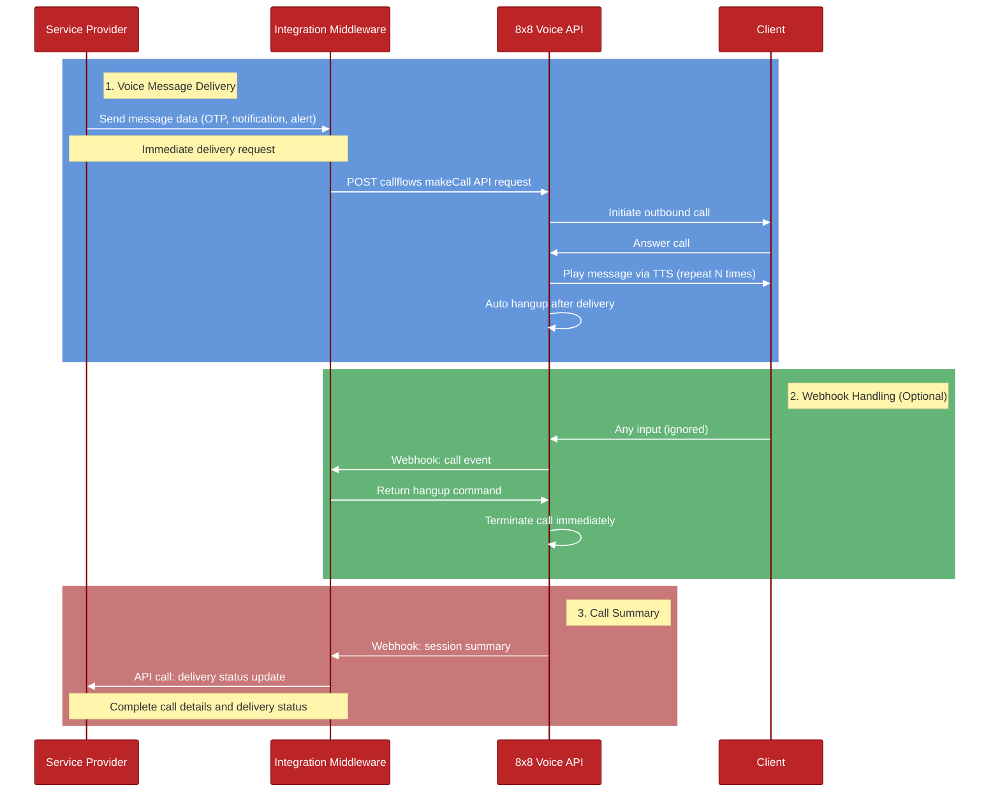

# System Interaction Flow Diagram

## Flow Description

1. **Initial Voice Message Request**
  - Client application sends message request to ngrok public URL
  - Ngrok forwards to local FastAPI server
  - FastAPI server calls 8x8 Voice API with message content
  - Response flows back through the chain
  - 8x8 initiates phone call to recipient
  - Message is delivered via text-to-speech (repeated N times)
  - Call automatically hangs up after message delivery

2. **VCA (Voice Call Action) Webhook**
  - If recipient provides any input during call (optional)
  - 8x8 Voice API sends call event to ngrok URL
  - Request forwarded to FastAPI
  - FastAPI processes and returns hangup command
  - Response flows back to 8x8 Voice API
  - Call terminates immediately

3. **VSS (Voice Session Summary) Webhook**
  - Call ends with recipient
  - 8x8 Voice API sends final call summary with delivery metrics
  - Request forwarded through ngrok to FastAPI
  - FastAPI processes delivery status and acknowledges
  - Simple 200 OK response returned
